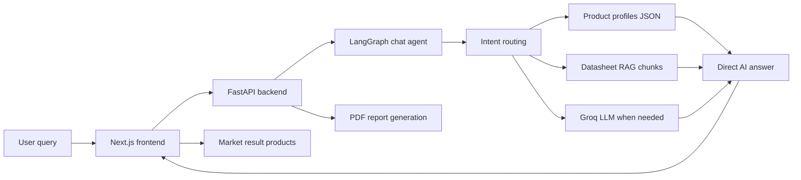

# NIRACONCHEM AI

NIRACONCHEM AI is a construction-chemicals recommendation platform for UAE and GCC project conditions. It helps users identify suitable products, understand where and how to use them, compare market options, analyze uploaded project files, and generate a technical PDF recommendation report.

The platform is designed for practical site questions such as waterproofing, tile fixing, flooring, concrete repair, sealants, primers, membranes, grouts, coatings, and related construction chemical systems.

## What Makes It Different

Most AI chatbots answer from general knowledge. NIRACONCHEM AI is built around construction-chemical decision logic and product data.

- Product-profile first: product recommendations are fetched from `data/vector_store/product_profiles.json`.
- Construction-specific routing: LangGraph routes greetings, general questions, brand questions, and technical product queries differently.
- Direct answers first: the AI answers the user query immediately instead of forcing long clarification forms.
- PDF readiness separately: extra project details are requested only when a technical PDF report needs complete project data.
- Datasheet-backed RAG: uploaded datasheets are ingested into local searchable chunks for technical context.
- UAE/GCC awareness: recommendation rules account for heat, UV, chloride, coastal exposure, hydrostatic pressure, traffic, and wet-area use.
- Market result layer: scraped QCON product data and images power product discovery in the frontend market section.
- File-aware workflow: users can upload PDFs, DOCX, XLSX, or TXT files and the backend extracts project signals.
- Report generation: the backend creates structured technical recommendation PDFs using ReportLab.

## Current Features

- AI chat interface for construction chemical questions
- Product recommendation from product profiles
- LangGraph-based chat brain
- Product explanation for why, how, where, and usage questions
- Market result section with product cards and images
- File upload and project document analysis
- RAG ingestion from datasheets
- PDF technical report generation
- Dark/light theme toggle
- Installable PWA frontend
- Mobile-responsive chat UI

## How It Works



## Internal Architecture

### Frontend

Location: `frontend/`

The frontend is a Next.js app. It provides the chat experience, file upload controls, product market results, PDF download action, theme switching, PWA support, and responsive UI.

Important files:

- `frontend/app/page.tsx` - main chat and market-result experience
- `frontend/app/globals.css` - responsive UI, liquid-glass styling, chat layout, market cards
- `frontend/app/data/qcon-market-products.json` - market product data used by the market results tab
- `frontend/public/assets/qcon-products/` - local product images
- `frontend/public/manifest.webmanifest` and `frontend/public/sw.js` - PWA support

### Backend

Location: `backend/`

The backend is a FastAPI service. It exposes chat, recommendation, file analysis, RAG ingestion, RAG status, and PDF report endpoints.

Important files:

- `backend/app/main.py` - API routes, recommendation engine, PDF report generation
- `backend/app/chat_agent_langgraph.py` - LangGraph chat brain
- `backend/app/rag_store.py` - product-profile loading, RAG chunk retrieval, scoring
- `backend/app/rag_ingest.py` - datasheet ingestion into local JSON indexes
- `backend/app/file_parser.py` - PDF, DOCX, XLSX, and TXT text extraction
- `backend/app/chat_sessions.py` - lightweight session memory
- `backend/app/agent_prompt.py` - construction-chemicals system prompt

### Data Layer

Location: `data/`

- `data/datasheets/` stores source datasheets and chemistry documents.
- `data/vector_store/product_profiles.json` stores structured product profile records.
- `data/vector_store/rag_chunks.json` stores searchable datasheet chunks.
- `data/vector_store/rag_index.json` stores local indexing metadata.

The current system uses local JSON storage for speed and simplicity. A production scale-up can move this layer to PostgreSQL plus a vector database such as Qdrant, Pinecone, Weaviate, or Chroma.

## LangGraph Chat Brain

The chat agent is implemented in `backend/app/chat_agent_langgraph.py`.

The graph flow is:

1. Normalize the user message.
2. Build context from current message and session history.
3. Route intent:
   - brand identity
   - greeting
   - general question
   - technical consultation
4. For technical queries, search all product profiles.
5. Score products using product name, brand, description, usage, price, URL, and construction synonyms.
6. Return direct product recommendations.
7. Mark PDF report as ready only when enough project details are present.

This keeps the conversation simple for users while still preserving professional report requirements.

## API Structure

Base backend URL in local development:

```text
http://localhost:8000
```

Main endpoints:

- `GET /health` - backend health check
- `POST /chat` - LangGraph-powered chat response
- `POST /recommend` - recommendation response
- `POST /recommend/report` - PDF report download
- `POST /analyze-file` - upload and analyze project files
- `POST /rag/ingest` - rebuild RAG/product indexes from datasheets
- `GET /rag/status` - inspect RAG index readiness

## Local Development

Run the backend and frontend in two separate terminals.

### 1. Backend

```powershell
cd "C:\Users\orsul\NIRACONCHEM AI\backend"
..\venv\Scripts\python.exe -m uvicorn app.main:app --host 127.0.0.1 --port 8000
```

Backend health check:

```text
http://127.0.0.1:8000/health
```

### 2. Frontend

```powershell
cd "C:\Users\orsul\NIRACONCHEM AI\frontend"
npm run dev
```

Open:

```text
http://127.0.0.1:3000
```

Important: run `npm run dev` inside the `frontend` folder. The backend is Python/FastAPI, so `npm run dev` will not work inside `backend`.

## Environment Variables

Create a backend `.env` file when using Groq:

```env
GROQ_API_KEY=your_groq_api_key
GROQ_MODEL=llama-3.1-8b-instant
FRONTEND_ORIGINS=http://localhost:3000,http://127.0.0.1:3000
```

Frontend local override:

```env
NEXT_PUBLIC_API_BASE_URL=http://localhost:8000
```

## Recommendation Behavior

The AI should:

- answer direct product and construction chemical questions immediately
- recommend chemical names from product profiles where available
- explain product use, where to apply it, why it fits, and how it is generally used
- avoid repeating long clarification questions
- only mention missing details as a short PDF-report requirement when needed
- avoid inventing product names that are not in the available data

Example:

```text
User: Which chemical should I use for fixing tiles stronger?
AI: Recommends tile adhesive products from product_profiles.json, explains suitable use, and gives practical installation guidance.
```

## PDF Report Logic

The AI can answer without all project fields. A PDF technical report needs more complete data:

- problem or required system
- application area
- substrate
- exposure condition
- project location

When those fields are available, the frontend shows the PDF download action and the backend generates a structured recommendation report.

## Market Result Section

The market result section uses QCON product data stored in:

```text
frontend/app/data/qcon-market-products.json
```

It ranks market products using the latest user query, AI reply, and extracted project context. Product images are stored locally under:

```text
frontend/public/assets/qcon-products/
```

This allows the platform to show practical product options next to the AI recommendation.

## Security Notes

- API keys must stay in `.env` and should never be committed.
- File upload size is limited in the backend.
- CORS is restricted to configured frontend origins and Vercel deployments.
- AI output should be treated as technical guidance, not final engineering approval.
- Final product selection must be verified against manufacturer datasheets, method statements, site conditions, and project specifications.

## Scaling Strategy

The current implementation is suitable for MVP and pilot use. For production scale:

- Move sessions from memory to Redis or PostgreSQL.
- Move product profiles to PostgreSQL with admin editing tools.
- Move RAG retrieval to Qdrant, Pinecone, Weaviate, or Chroma.
- Add authentication and role-based access.
- Add observability with structured logs, tracing, and AI evaluation datasets.
- Add background workers for ingestion and PDF generation.
- Add product-profile versioning and approval workflow.

## Future Roadmap

- Camera/image upload for construction-site analysis
- Vision-based detection of cracks, dampness, tile defects, and surface conditions
- Admin dashboard for product profile management
- Manufacturer comparison engine
- Live climate and weather API integration
- Project history and saved reports
- User accounts and organization workspaces
- Advanced specification generator
- Mobile-first site inspection workflow
- Multi-language support for UAE/GCC users

## Deployment

Current deployment files:

- `vercel.json` for frontend deployment
- `render.yaml` for backend deployment

Recommended production setup:

- Frontend: Vercel
- Backend: Render, Railway, Fly.io, AWS, Azure, or GCP
- Storage: PostgreSQL plus object storage for reports and uploaded files
- Vector search: Qdrant or Pinecone
- Cache/session store: Redis

## Tech Stack

- Frontend: Next.js, React, TypeScript, CSS, lucide-react
- Backend: Python, FastAPI, Pydantic, LangGraph, Groq
- Documents: pypdf, python-docx, openpyxl
- Reports: ReportLab
- Data/RAG: local JSON indexes, datasheet chunks, product profiles
- Deployment: Vercel and Render configuration

## Disclaimer

NIRACONCHEM AI provides AI-assisted construction chemical guidance based on available product profiles, datasheets, project inputs, and retrieval logic. Final selection must be reviewed by qualified technical personnel and verified against official manufacturer datasheets, site conditions, local standards, and project specifications.
